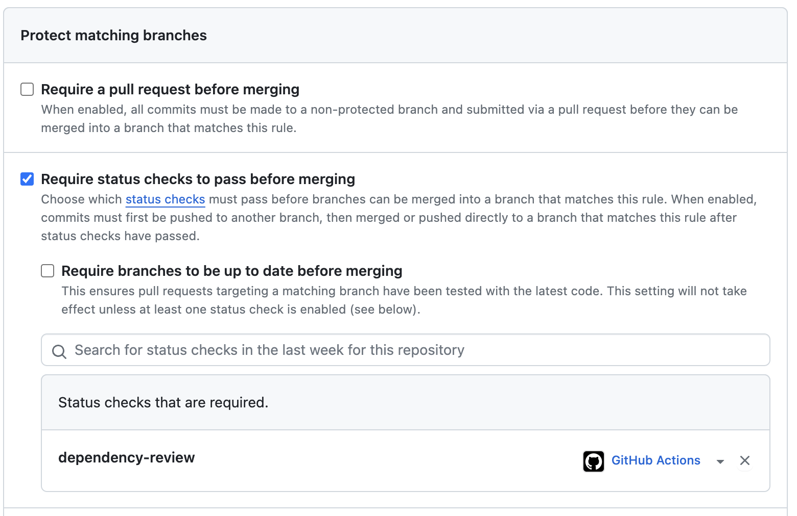

# Test GitHub Advance Security

Using Dependabot for SCA testing and CodeQL for SAST testing.

For Dependabot:

- Under the Settings tab in the repository, navigate to Branches

- Create a branch protection rule for your default branch and check the "Require status checks to pass before merging" box

- Add the dependency review job as a status check "dependency-review" (.github/workflows/dependabot.yaml)

